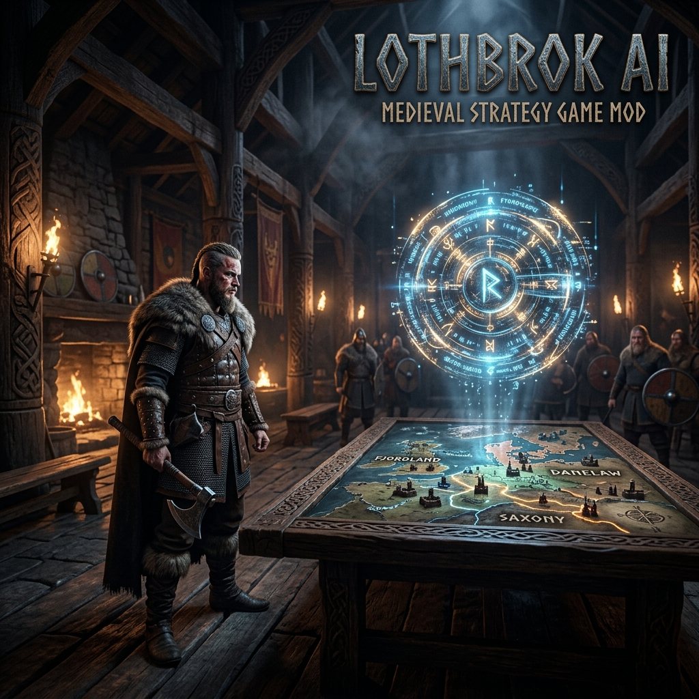

  

# ⚔️ LothbrokAI
> *"An Agentic Intelligence Overhaul for Mount & Blade II: Bannerlord"*

**LothbrokAI** completely replaces Bannerlord's static conversation trees and rigid faction logic with an emergent, autonomous, LLM-driven political and social ecosystem. NPC Lords and Wanderers don't just speak dynamic dialogue—they generate deeply personal memories, forge alliances, plot betrayals, spread rumors, and construct cascading diplomatic pacts completely devoid of the legacy game's restrictions. 

Welcome to a living Calradia. 

---

## 🔥 Core Features

### 🧠 The Medici Engine (Social Graph & Memory)
- **JSON "Sidecar" Memory:** Bannerlord's native `.sav` system wasn't built for millions of tokens. We bypass the main save file, storing per-NPC JSON files that track lifetime conversations, evolving emotional trust models, romance meters, and TF-IDF memory vectorization.
- **Dynamic First-Contact:** The moment you speak to an NPC, the LLM parses their in-game stats (skills, realm, location, traits) and autonomously rolls a unique 200-word personality profile, complete with cultural speech quirks. They will never forget who they are, and they will never forget what you've done.

### 📜 Asynchronous Dialogue Pipeline
- The LLM parses dialogue natively via the vanilla conversation UI flawlessly using `Task.Run()` background threading and `System.Collections.Concurrent` data structures. You will never experience UI lag, freeze frames, or save corruptions while waiting for the AI to "think".
- Includes fail-safe fallbacks: no more being trapped in dialogue nodes if the API times out.

### 🛡️ Standalone Alliance & War Cascade Engine
- Replaces legacy, conflict-heavy dependency mods.
- The LLM generates physical, logical events (like War, Peace, Alliances, Non-Aggression Pacts) directly negotiated through dialogue. 
- Fully functional cascading "Pact Systems". If you declare war on a kingdom, their networked allies will respond immediately in the engine. It’s geopolitical narrative-driven storytelling.

### 🎲 The Action Engine:  "The Game Decides. The AI Narrates."
NPC conversations output structured `.json` payloads behind-the-scenes. The LLM dictates the actions, but our `ActionEngine` executes them securely on the Bannerlord main-thread.
- *Gain/lose relationship points naturally through conversation.*
- *Bribe lords directly via dialogue, securely shifting inventory gold.*
- *Give custom "Rumor Missions" to followers to spread discord.*

---

## 🛠️ Installation & Setup

1. **Install Prerequisites**: 
   - Bannerlord `v1.2.9+`
   - [Harmony](https://www.nexusmods.com/mountandblade2bannerlord/mods/2006)
   - [UIExtenderEx](https://www.nexusmods.com/mountandblade2bannerlord/mods/2102)
   - [ButterLib](https://www.nexusmods.com/mountandblade2bannerlord/mods/2018)
2. **Download & Extract**: Clone this repository into `Modules/LothbrokAI`.
3. **Configure the AI Mind**: Copy `data/config.example.json` to `data/config.json`. Add your LLM keys here.
   - **Supported Backends:** `OpenRouter`, `DeepSeek`, `LM Studio`, `Ollama`, `KoboldCpp`.
   - *Tip: We highly recommend `x-ai/grok-4.1-fast` via OpenRouter for high-speed, engaging responses.*
4. **Boot the Game**: Ensure `LothbrokAI` loads *after* your core libraries in the launcher. Step into the nearest tavern and introduce yourself.

---

## 🏗️ Modding Architecture

Are you looking to fork and extend LothbrokAI? Everything you need for Agentic Coding and Modding is indexed locally!
* If using GitHub Copilot or an AI Assistant, open [agents.md](agents.md) as your ultimate knowledge source for framework blueprints, UI node configurations, and concurrent thread manipulation.
* Need structural code intelligence? Check the `docs/` hierarchy or utilize `cli/navigator.py`!

---

*LothbrokAI was forged iteratively via the Adaptive Semantic Lattice (ASL) Agent Architecture.*
