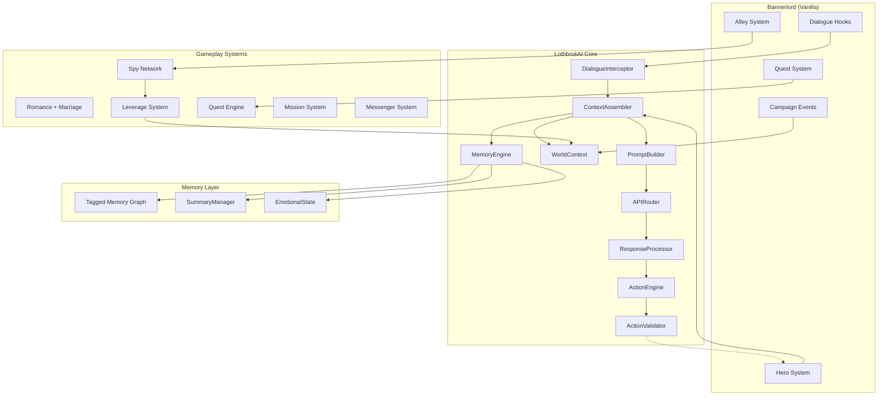

# LothbrokAI — System Design

*Full replacement mod for AIInfluence with proper memory architecture*

---

## Scope Decision: What Are We Actually Building?

### AIInfluence Feature Inventory

The mod we're replacing has **1,755 types** across 25+ namespaces. That's not a weekend project — that's a production application. Before we commit to a full rewrite, let's be honest about what it contains:

| System | Types | What It Does | Do We Need It? |
|--------|-------|-------------|----------------|
| **Core (Dialogue + Context)** | 124 | NPC conversations, prompt building, context management | ✅ YES — this is the whole point |
| **API Layer** | 67 | OpenRouter, Ollama, KoboldCpp, DeepSeek integration | ✅ YES — but simpler |
| **Diplomacy** | 163 | Kingdom statements, alliances, wars, trade, tributes, reparations | ⚠️ REDESIGN — broken for 82 kingdoms |
| **Dynamic Events** | 111 | World event generation, propagation, NPC awareness | ⚠️ LATER — nice to have, not core |
| **Diseases** | 51 + 37 patches | Spread, immunity, quarantine, treatment | ❌ SKIP — bloats save data, annoying gameplay |
| **Settlement Combat** | 45 | Settlement battles, boundary enforcement | ✅ REDESIGN — for duels and intrigue scenes |
| **Battle Tactics** | 12 | AI battle orders during combat | ❌ SKIP — not AI-conversation related |
| **AI Actions** | 35 | NPC task system (follow player, patrol, etc.) | ✅ REDESIGN — companion missions, spy deployment |
| **Group Conversation** | 47 | Multi-NPC dialogue | ✅ YES — councils, conspiracies |
| **Death History** | 5 | Death logging | ❌ SKIP — trivial |
| **Services** | 10 | TTS, lip sync | ❌ SKIP — cosmetic |
| **UI** | 2 | Text query popup | ✅ YES — need dialogue UI |
| **Vanilla Patches** | 25 | Bug fixes, guards | ✅ CHERRY-PICK what we need |
| **Obfuscated** | 548 | Unknown (encrypted namespaces) | ❓ Can't assess |

### Three Strategic Options

#### Option A: Full Standalone Mod
Build LothbrokAI from scratch. Replace AIInfluence entirely.

| Pros | Cons |
|------|------|
| Clean architecture from day one | 1,755 types to replace (even if we skip half) |
| No dependency on obfuscated code | We lose features that work fine (romance, intimacy, etc.) |
| Our memory system at the core | Weeks of work for feature parity |
| Full control over data formats | Need to replicate all the vanilla hooks |

#### Option B: Smart Patchset (What We Built Tonight)
Keep AIInfluence running, intercept its pipeline with Harmony patches.

| Pros | Cons |
|------|------|
| 1 day of work | Still dependent on AIInfluence's broken architecture |
| All 1,755 types of features still work | Can't fix fundamental issues (sync I/O, diplomacy loops) |
| Compatible with existing saves | Obfuscation could break with mod updates |
| Low risk | We're always fighting their code |

#### Option C: Hybrid — Core Replacement + Feature Bridge ⭐ **Recommended**
Build our own dialogue/memory/context engine, but **bridge** AIInfluence's features we want to keep (romance, intimacy, AI actions) via Harmony patches.

| Pros | Cons |
|------|------|
| Clean core (the part that matters most) | Two mods running simultaneously |
| Keep working features via bridge | More complex load order |
| Incremental migration — disable AIInfluence systems one by one | Need to understand their data format |
| Our memory architecture at the center | Bridge patches could break on update |

> [!IMPORTANT]
> **Recommended: Option C.** We build our own dialogue + memory + context engine from scratch. For features like romance, intimacy, AI actions — we bridge them from AIInfluence initially, then migrate them to our codebase one by one over time. This gives us the best architecture without losing gameplay features.

---

## Architecture: LothbrokAI Core

### Overview



### Dialogue Flow

```
Player initiates conversation with NPC
  │
  ├─ 1. DialogueInterceptor (Harmony hook on vanilla dialogue)
  │     ├─ Captures: who is speaking, where, what context
  │     └─ Creates: ConversationContext object
  │
  ├─ 2. MemoryEngine.Retrieve(npcId, playerMessage)
  │     ├─ Vector search: top-5 semantically relevant past exchanges
  │     ├─ Summary: rolling compressed history
  │     ├─ Recency: last 4 raw messages
  │     └─ Returns: MemoryPayload (~1,500 tokens)
  │
  ├─ 3. WorldContext.Assemble(npc, location)
  │     ├─ NPC identity: personality, backstory, quirks (~500 tokens)
  │     ├─ Relationship: trust, romance, faction standing (~200 tokens)
  │     ├─ Location: where they are, who's nearby (~200 tokens)
  │     ├─ Relevant events: filtered by NPC's kingdom/location (~300 tokens)
  │     └─ Returns: WorldPayload (~1,200 tokens)
  │
  ├─ 4. PromptBuilder.Build(memory, world, systemPrompt)
  │     ├─ System prompt: character instructions (~500 tokens)
  │     ├─ Memory payload: (~1,500 tokens)
  │     ├─ World payload: (~1,200 tokens)
  │     ├─ Token budget enforcement: MAX 4,000 tokens total
  │     └─ Returns: final prompt string
  │
  ├─ 5. APIRouter.Send(prompt, backend)
  │     ├─ Routes to: OpenRouter / Ollama / KoboldCpp / DeepSeek
  │     ├─ Async (off game thread)
  │     ├─ Retry with exponential backoff
  │     └─ Returns: AI response string
  │
  └─ 6. DialogueInterceptor.DisplayResponse(response)
        ├─ Shows response in game UI
        ├─ Stores full exchange in MemoryEngine
        └─ Updates NPC state (trust, romance, etc.)
```

### Token Budget

| Component | Max Tokens | Purpose |
|-----------|-----------|---------|
| System prompt | 500 | Character behavior instructions |
| NPC identity | 500 | Personality, backstory, speech quirks |
| Memory summary | 300 | Compressed history |
| Retrieved memories | 800 | Top-5 relevant past exchanges |
| Recent messages | 400 | Last 4 raw messages (conversational flow) |
| World context | 500 | Location, events, diplomacy |
| Relationship state | 200 | Trust, romance, faction |
| **TOTAL INPUT** | **3,200** | vs AIInfluence's 40,000-50,000 |
| Response budget | 800 | Max response length |
| **TOTAL** | **4,000** | **~10x reduction** |

---

## Core Components

### 1. DialogueInterceptor

**What:** Harmony hooks on Bannerlord's vanilla dialogue system to capture and redirect NPC conversations.

**Vanilla hooks needed** (learned from AIInfluence's patches):

| Hook | Vanilla Class | Purpose |
|------|--------------|---------|
| Conversation start | `ConversationManager` | Detect when player talks to NPC |
| Dialogue line injection | `DialogFlow` / `ConversationSentence` | Insert AI-generated responses |
| Player input capture | `TextQueryPopup` (UIExtenderEx) | Get player's typed message |
| Conversation end | `ConversationManager` | Trigger memory save |
| Menu guard | `EncounterGameMenuBehavior` | Prevent crashes on null encounters |
| NPC identification | `CharacterObject` / `Hero` | Map game NPC to our context |

**Key design:** We use `CampaignBehaviorBase` for lifecycle events + Harmony for vanilla method interception.

### 2. MemoryEngine

**What:** Per-NPC semantic memory with vector retrieval and rolling summaries.

**Architecture:**

```
MemoryEngine
├── VectorStore (per-NPC)
│   ├── Embedding: remote API (LM Studio on network or OpenRouter)
│   ├── Models: all-MiniLM-L6-v2 or nomic-embed-text (via API)
│   ├── Index: cosine similarity (no FAISS needed for <1000 vectors per NPC)
│   ├── Storage: JSON sidecar files ({npcId}.lothbrok.json)
│   ├── Caching: vectors stored locally, only new text gets embedded
│   └── Operations: Insert, TopK, Prune
│
├── TaggedMemoryGraph
│   ├── Tags: NPC names, locations, topics, factions
│   ├── Spreading: 1-hop via shared tags on retrieval
│   └── Purpose: "ask about Norena" also retrieves romance, Battania, wedding
│
├── SummaryManager
│   ├── Trigger: every 10 new messages
│   ├── Method: LLM-generated summary (uses same API backend)
│   ├── Storage: inline in memory file
│   └── Fallback: extractive summary (no LLM, keyword-based)
│
└── ConversationLog
    ├── Full raw history (never pruned)
    ├── Append-only JSON log
    └── Used for: re-embedding, summary regeneration, export
```

**Phase 1 (MVP):** TF-IDF keyword retrieval (ported from our hotfix patch). No embeddings.
**Phase 2:** Remote embeddings via LM Studio (network) or OpenRouter API. Zero local compute — the game machine stays fast.

### 3. WorldContext

**What:** Assembles relevant world state for the NPC, filtered and budgeted.

**Filters:**
- **Kingdom filter:** Only events involving the NPC's kingdom
- **Geographic filter:** Only nearby settlements (within 2-day travel)
- **Recency filter:** Only events from last 20 game-days
- **Relevance cap:** Max 3 events, max 2 diplomatic statements

**Caching:** Static data (world description, kingdom list) cached and only refreshed on game load, not every conversation.

### 4. PromptBuilder

**What:** Assembles the final LLM prompt with strict token budgeting.

**Design:**
- Each component has a max token allocation
- If a component exceeds budget, it's truncated with `...` and a note
- System prompt is templated (Jinja-like with `{npc_name}`, `{player_name}`, etc.)
- Prompt templates are plain text files — hot-reloadable, user-editable

### 5. APIRouter

**What:** Routes prompts to configured LLM backend.

**Backends:** OpenRouter, Ollama, KoboldCpp, DeepSeek (same as AIInfluence)

**Key improvements over AIInfluence:**
- **Async execution** — API call runs off the game thread
- **Token counting** — estimate tokens before sending, warn if over budget
- **Rate limiting awareness** — track calls per minute, back off proactively
- **Response caching** — cache identical prompts (e.g., same greeting)

### 6. ActionEngine — "Game Decides, AI Narrates"

**What:** Parses player action intents from dialogue and resolves them against real game mechanics.

**The problem with the old mod:** Actions like `*I attack the lord*` were decided by the LLM. Some models let you assassinate anyone, others refused everything. Inconsistent and exploitable.

**Our approach:**

```
Player: *I attempt to kill the lord*
  │
  ActionParser extracts: { intent: "attack", target: "lord", method: "melee" }
  │
  ActionValidator checks game state:
  ├─ Player combat skill: 180
  ├─ Target combat skill: 220
  ├─ Guards present: 4 (garrison_size / 50)
  ├─ Location modifier: throne_room = 0.5x (disadvantage)
  ├─ Weapon equipped: yes (+0.2x)
  ├─ Relationship: hostile (+0.1x) / allied (-0.5x)
  │
  Probability: 15%
  │
  Roll → Outcome enum: { CritSuccess, Success, Partial, Failure, CritFailure }
  │
  LLM receives: "The player attempted to attack. OUTCOME: Failure. Guards intervened."
  LLM narrates the result (doesn't choose it)
```

**Action types mapped to game mechanics:**

| Action | Game Mechanic | Skill Check |
|--------|--------------|-------------|
| Attack/Kill | Combat skill + party strength | One-Handed/Two-Handed |
| Steal | Roguery + alley control | Roguery |
| Persuade | Charm + relationship | Charm |
| Intimidate | Party strength + renown | Leadership |
| Bribe | Gold check | Trade |
| Seduce | Charm + romance level | Charm |
| Escape | Athletics + guards | Athletics |
| Forge document | Roguery + crafting | Roguery |

### 7. Emotional State Machine

**What:** Tracks NPC emotional state across conversations. Feeds back into prompt and affects trust/romance progression.

**States:** Neutral → Warm / Hostile / Fearful / Amused / Suspicious / Romantic

**Transitions:** Based on player dialogue tone (detected via keyword analysis on AI response):
- Insults → +hostility → if sustained → NPC ends conversation or attacks
- Flattery → +warmth → if sustained → trust increases
- Threats → +fear → if NPC is weaker → compliance; if stronger → hostility
- Humor → +amusement → trust increases faster

**Persistence:** Emotional state persists between conversations but decays toward neutral over game-days.

### 8. NPC Personality Generator

**What:** On first contact with any NPC, generates personality, backstory, and speech quirks via LLM.

**Input to LLM:**
- NPC's game attributes (culture, clan, age, skills, traits)
- Location and social role (lord, merchant, companion, villager)
- Current world state (at war? ruling? imprisoned?)

**Output (cached forever):**
- Personality description (~100 words)
- Backstory (~100 words)
- 2-3 speech quirks (from predefined list + custom)

**Design:** Only runs ONCE per NPC. Cached in memory file. Never regenerated unless manually reset.

### 9. Companion Mission System

**What:** Send companions on NPC-style missions with real game outcomes.

**Examples:**
- Send healer to treat a wounded lord → relation boost, creates news notification
- Send spy to infiltrate a settlement → generates intel, feeds spy network
- Send diplomat to negotiate → may prevent/trigger war declaration
- Send scout to survey → reveals army movements

**Integration:** Uses Bannerlord's `IssueBase.AlternativeSolution` pattern. Companion leaves party, timer ticks, outcome resolves based on companion skills.

### 10. Messenger System

**What:** Send letters/messages to NPCs at a gold cost. Can be intercepted.

**Flow:**
- Player writes message via dialogue interface
- Costs gold (distance-based, like trade routes)
- Messenger travels in real time (campaign map)
- Recipient NPC receives message, may respond
- **Interception:** Enemy parties on the route may intercept → becomes leverage for them

### 11. Marriage System (Norse Polygamy)

**What:** Extended marriage system supporting multiple spouses through negotiation.
Port existing console commands from AIInfluenceHotfix.

**Norse rule:** Player can propose multiple marriages if:
- Current spouse approves (persuasion check)
- Target's clan approves (relation + bride price)
- Cultural compatibility (Sturgian/Battanian traditions favor polygamy)

### 12. NPC Command System

**What:** Give orders to lords and companions through dialogue.

**Commands:**

| Command | Game Action | Known Bugs to Guard |
|---------|-----------|-------------------|
| "Follow me" | NPC party follows player | **Governor bug**: if NPC is governor, town becomes "no governor" → ship selling crashes, settlement income breaks. MUST check `Hero.GovernorOf` and either reassign governor or prevent follow. |
| "Go to [settlement]" | NPC moves party to target | Must validate settlement exists and is reachable |
| "Patrol around [settlement]" | NPC patrols area | Uses `SetPartyAiAction.PatrolAroundSettlement` |
| "Garrison at [settlement]" | NPC enters garrison | Must check if settlement accepts (owned/allied) |
| "Guard the area" | NPC patrols current position | Uses `SetPartyAiAction.PatrolAroundPoint` |
| "Stop following / Dismiss" | NPC resumes default AI | Must restore governor status if applicable |
| "Wait here" | NPC holds position | Prevents AI from overriding |

**Critical guards (learned from our hotfix):**
- Check `Hero.GovernorOf` before any movement command
- Check if NPC is in an army (can't leave army without marshal permission)
- Check if NPC's clan has enough parties (can't remove last party)
- Re-assign governor on dismiss if NPC was previously governing

### 13. Kingdom Management Through Dialogue

**What:** Manage kingdom operations through conversations with relevant NPCs.

**Council conversations (with clan leaders):**
- Propose war declarations (with council vote simulation)
- Propose peace negotiations
- Propose policy changes (using Bannerlord's `PolicyObject` system)
- Discuss fief distribution after conquest

**Governor conversations:**
- Set settlement production priorities
- Set garrison strength targets
- Request settlement upgrades
- Review settlement income/expenses

**Marshal/Army conversations:**
- Form army (call vassals)
- Set campaign objective (siege, raid, defend)
- Dismiss army

**Key design:** These conversations use the ActionEngine — the AI interprets intent, the game validates and executes. For example:
```
Player to vassal: "I want to declare war on Vlandia"
  → ActionEngine extracts: { intent: "declare_war", target: "vlandia" }
  → Validator checks: player is ruler? kingdom has enough strength? 
  → If valid: triggers council vote or direct declaration
  → LLM narrates the vassal's reaction to the decision
```

---

## Data Format

### NPC Memory File (`{npcId}.lothbrok.json`)

```json
{
  "npcId": "CharacterObject_1949",
  "npcName": "Gunjadrid",
  "version": 1,
  "summary": {
    "text": "Gunjadrid is a loyal Sturgian warrior. We've discussed...",
    "updatedAt": "2026-04-15T22:00:00Z",
    "coversMessages": 77
  },
  "conversationLog": [
    {"role": "player", "text": "...", "timestamp": "...", "gameDay": 142},
    {"role": "npc", "text": "...", "timestamp": "...", "gameDay": 142}
  ],
  "embeddings": [
    {"text": "Player asked about the war with Vlandia...", "vector": [0.12, ...], "index": 5}
  ],
  "metadata": {
    "interactionCount": 40,
    "trustLevel": 0.72,
    "romanceLevel": 0.0,
    "lastInteraction": "2026-04-15T21:00:00Z"
  }
}
```

### World Context Cache (`_world_cache.json`)

```json
{
  "worldDescription": "cached world.txt content",
  "kingdoms": {"sturgia": {"name": "...", "leader": "...", "settlements": [...]}},
  "cachedAt": "2026-04-15T22:00:00Z",
  "refreshOnLoad": true
}
```

---

## Save Synchronization Architecture

**Problem (from the old mod):** NPC data lived in external files, independent of game saves. When the game crashed and the player reloaded a save from 2 hours ago, the mod remembered conversations that hadn't happened yet in the reloaded timeline. Temporal desync → NPCs reference events from "the future."

**Solution: Hybrid save — critical state inside game save, text data in external files with watermarks.**

### Layer 1: Critical State → Bannerlord SyncData (guaranteed sync)

Uses `CampaignBehaviorBase.SyncData(IDataStore)` to serialize into the `.sav` file:

```csharp
// Saved inside game's own save file — reloads perfectly
public override void SyncData(IDataStore dataStore)
{
    // Per-NPC critical state (compact, game-affecting)
    dataStore.SyncData("lothbrok_trust", ref _trustLevels);
    dataStore.SyncData("lothbrok_romance", ref _romanceLevels);
    dataStore.SyncData("lothbrok_emotional", ref _emotionalStates);
    
    // Global state
    dataStore.SyncData("lothbrok_reputation", ref _reputation);
    dataStore.SyncData("lothbrok_leverage", ref _leverageEntries);
    dataStore.SyncData("lothbrok_conspiracies", ref _activeConspiracies);
    dataStore.SyncData("lothbrok_quests", ref _activeQuests);
    dataStore.SyncData("lothbrok_watermark", ref _lastSavedGameDay);
}
```

**When player reloads:** all trust, romance, reputation, quests, and leverage roll back to the save point automatically. No custom logic needed — Bannerlord handles it.

### Layer 2: Text Data → External Files with Watermark Pruning

Conversation history, personality, memories stay in `.lothbrok.json` files (too large for SyncData).

**On game load:**
```
1. SyncData restores critical state → trust, romance, etc. at save point
2. Read game-day watermark from SyncData → "this save was at Day 50"
3. Load .lothbrok.json files
4. PRUNE: remove all entries where gameDay > 50
   → Conversations from Day 51, 52 disappear
   → Memories from those conversations disappear
   → Personality and backstory are NOT pruned (generated once, timeless)
5. Regenerate summary from remaining entries
6. Save pruned files back to disk
```

**On game save:**
```
1. SyncData saves critical state + current game day watermark
2. Flush all .lothbrok.json files to disk
3. Both are now synchronized at this point in time
```

### Edge Cases

| Scenario | Behavior |
|----------|----------|
| Crash + reload earlier save | External files pruned to match save's game-day |
| Load a much older save | Large prune — many conversations removed, state fully restored from SyncData |
| Quick-save / quick-load | Minimal prune — only a few entries removed |
| First load (no save data) | Fresh state, empty SyncData, external files from previous sessions pruned |
| Save corruption | SyncData missing → fall back to external files as-is, log warning |

### Why Hybrid?

| Approach | Problem |
|----------|---------|
| Everything in SyncData | Save files balloon (conversation text is huge) |
| Everything external | Temporal desync (the old mod's bug) |
| **Hybrid** | **Critical state always in sync + text data prunable** |

---

## Advanced Feature Systems

### AI Quest System

The old mod generated quests dynamically through NPC dialogue but they were "dumb" — e.g., asking to collect sea raider axes (not a real item). LothbrokAI quests will be **game-mechanic-aware**.

**Design:**
- LLM generates quest *intent* ("Lord X wants rival weakened") — not specific items
- Our code validates the intent against game state and generates valid objectives
- Quest types map to real Bannerlord mechanics:

| Quest Type | Bannerlord Mechanic | Example |
|------------|--------------------|---------|
| Deliver message | Party movement + dialogue | "Carry this letter to King Caladog" |
| Gather intelligence | Alley spy network | "Find out who betrayed clan Fen Derngil" |
| Weaken rival | Raid/battle mechanics | "Raid Vlandian caravans near Seonon" |
| Political favor | Relation system | "Convince Lord X to support our war declaration" |
| Escort/protect | Party follow mechanics | "Escort my daughter to Car Banseth" |
| Acquire item | Trade/loot system | "Bring me 50 units of hardwood" (validated item!) |
| Duel | Settlement combat | "Challenge Lord Y to single combat" |

**Negotiation completion:** Player can talk their way out of quest requirements. The AI evaluates the player's argument and can accept modified completion (e.g., "I couldn't find the item but I discovered who stole it").

**Quest items:** AI can generate narrative items (letters, maps, tokens) that exist as real inventory items. Uses Bannerlord's `ItemObject` creation API.

### Companion Spy Network

Integrates with Bannerlord's existing `Alley`, `IssueBase`, and companion systems.

**Confirmed Bannerlord APIs:**
- `Alley.Owner` (Hero) — we can assign companions as alley owners
- `Alley.State` (AreaState) — tracks alley control
- `AlleyHelper` — existing alley management utilities
- `IssueBase.AlternativeSolutionCondition` — companion mission framework
- `RogueSkillsTag` — rogue-specific conversation tags

**Flow:**
```
Player takes alley → Assigns companion as "spymaster"
  │
  ├─ Companion generates rumors on HourlyTick
  │   ├─ Based on: settlement, visiting lords, trade activity
  │   ├─ Rogue skill level → quality/accuracy of intel
  │   └─ Stored in companion's memory (retrievable in dialogue)
  │
  ├─ Intel types:
  │   ├─ "Lord X is planning war against Kingdom Y" (diplomatic)
  │   ├─ "A caravan carrying silver passed through" (economic)
  │   ├─ "The governor is sick and the garrison is weak" (military)
  │   └─ "Lord X met secretly with Lord Y" (intrigue)
  │
  └─ Player retrieves intel through conversation with companion
      └─ Intel becomes "leverage" usable in diplomacy
```

### Political Intrigue System — *"The Medici Engine"*

*Inspired by Renaissance Italian politics: the Medici didn't conquer Florence with armies — they conquered it with ledgers, marriages, and whispered favors. Power in Calradia should work the same way.*

---

#### FIRST PRINCIPLE: Relationship Gates Everything

**The old mod:** LLM decided outcomes. You could convince anyone of anything if you used the right words. Relationship was flavor text.

**LothbrokAI:** Relationship is the **hard gate**. The LLM narrates, but the game decides what's possible.

| Relationship Level | What You Can Do | What You Can't |
|-------------------|----------------|----------------|
| **Lover / Life Debt** (+80 to +100) | Manipulate into almost anything. Ask to betray their lord. Ask to spy. They'd die for you. | Make them betray their own children. |
| **Trusted Ally** (+50 to +79) | Persuade on most matters. Call in favors. Get honest intel. | Make them rebel against a ruler they also love. |
| **Friendly** (+20 to +49) | Normal persuasion. Trade favors. Persuasion checks with Charm. | Complex manipulation. Won't risk their position for you. |
| **Neutral** (-19 to +19) | Basic conversation. Simple requests. Need evidence to persuade. | Any form of manipulation. They have no reason to trust you. |
| **Hostile** (-20 to -49) | They'll talk, but suspiciously. Need overwhelming evidence or leverage. | Direct persuasion. They assume you're lying. |
| **Enemy** (-50 to -100) | **BLOCKED.** They won't even listen. | Everything. **You need a proxy.** |

**Proxy chains for enemies:**
```
Target: Lord Raganvad (relation: -60, ENEMY)
  │
  ├─ Direct? IMPOSSIBLE. He refuses to engage.
  │
  ├─ Map the social graph:
  │   ├─ Who trusts Raganvad? → Lady Elthild (+72), Lord Olek (+55)
  │   ├─ Who do YOU have access to? → Lady Elthild (+30 with you)
  │   └─ Elthild is the bridge.
  │
  ├─ Build trust with Elthild: favors, gold, missions
  │   └─ Elthild: +30 → +55 (now you can persuade her)
  │
  ├─ Manipulate Elthild → she influences Raganvad
  │   └─ Social propagation: Raganvad softens (-60 → -40)
  │
  └─ Repeat through multiple proxies. Deep hate = long chains.
     A lover can do what an army cannot.
```

**This is the law:** The deeper the hate, the longer the chain. The closer the love, the shorter the path to power.

---

#### 1. Social Influence Propagation

**Core mechanic:** NPCs affect other NPCs' relationships. Opinions spread through social networks.

**Player manipulation via dialogue:**
```
Player to Gunjadrid: "Lord Raganvad starves his people while he feasts"
  │
  ├─ Persuasion check: Charm skill vs Gunjadrid's trust in Raganvad
  │   ├─ Modified by: player trust level with Gunjadrid
  │   ├─ Modified by: evidence provided (spy intel = bonus)
  │   └─ Modified by: NPC traits (Gullible=easy, Calculating=hard)
  │
  ├─ SUCCESS → Gunjadrid's relation with Raganvad drops
  │   ├─ If Gunjadrid has trait "Gossip": tells 2-3 nearby NPCs (attenuated)
  │   ├─ If Gunjadrid has trait "Loyal": refuses, may warn Raganvad
  │   └─ If Gunjadrid has trait "Opportunist": keeps info for own leverage
  │
  └─ FAILURE → Gunjadrid suspects manipulation
      └─ Trust in player drops. May warn target.
```

**Organic word of mouth:**
- NPCs with high trust in player proactively praise you to other NPCs
- NPCs you've wronged warn others about you
- Propagation attenuates: 1st hop = 100%, 2nd hop = 50%, 3rd hop = 25%
- Uses Bannerlord's `CharacterRelationManager.SetHeroRelation` for real game impact

**Rumor-driven rebellion:**
```
Plant rumor via spy: "Raganvad secretly negotiates with Vlandia"
  │
  ├─ Rumor enters NPC gossip graph
  ├─ Suspicious lords hear it → relation with Raganvad drops
  ├─ If relation drops below threshold → rebellion check
  │   ├─ Clan strength vs kingdom strength
  │   ├─ Number of allied clans (faction support)
  │   └─ Hooks into Separatism mod if present → kingdom split
  │
  └─ If rumor is proven false → YOUR reputation takes the hit
```

#### 2. Faction Dynamics (within kingdoms)

**Within each kingdom, lords form informal factions based on relationship clusters:**

| Faction Type | Description | Example |
|-------------|-------------|---------|
| **Loyalists** | Support current ruler unconditionally | "The king's word is law" |
| **Reformists** | Want policy changes, council power | "We need new trade agreements" |
| **Hawks** | Want war, expansion, glory | "Vlandia is weak — we should strike" |
| **Doves** | Want peace, trade, stability | "Another war will bankrupt us" |
| **Conspirators** | Secretly plotting against ruler | "The throne should be ours" |

**Factions are emergent, not hardcoded.** The system looks at NPC-to-NPC relationship clusters and labels groups dynamically. A lord isn't "a Hawk" — they have hawkish tendencies that grow through events and dialogue.

**Player can:**
- Court a faction (raise relations with all members through dialogue/favors)
- Set factions against each other (tell Hawks that Doves betrayed them)
- Build a cross-faction coalition for a specific goal (council vote, war declaration)

#### 3. Conspiracy Engine

**Multi-step plots that unfold over game-time:**

```
CONSPIRACY: Overthrow King Raganvad

Step 1: Build Support (5-15 game-days)
  ├─ Recruit 3+ clan leaders to your cause
  ├─ Each requires: high relation + motivation (grievance against ruler)
  ├─ Can use leverage to shortcut persuasion
  │
Step 2: Weaken the Crown (5-10 game-days)
  ├─ Spread rumors (social influence system)
  ├─ Intercept royal correspondence (spy network)
  ├─ Disrupt trade (raid caravans, close workshops)
  │
Step 3: The Strike
  ├─ Call a council meeting (kingdom management dialogue)
  ├─ Present evidence/leverage
  ├─ Council votes: faction support determines outcome
  ├─ OR direct confrontation (settlement combat)
  │
RISK: If discovered at any step:
  ├─ Ruler learns of conspiracy → arrests/exile
  ├─ Conspirator NPCs may betray you (based on their traits)
  └─ Reputation hit: "oath-breaker" stigma
```

**Counter-conspiracy:** NPCs can plot against YOU. If you're king and your spymaster detects a conspiracy, you can:
- Confront conspirators
- Plant counter-intelligence
- Make preemptive concessions (give fief to potential rebel)
- Execute/exile ringleader (reputation consequences)

#### 4. Reputation System (Three Axes)

**Not a single number — three separate reputations that create different play styles:**

| Axis | Gained By | Effect |
|------|----------|--------|
| **Honor** | Keeping oaths, fair dealing, mercy | Lords trust your word. Alliances are easier. Breaking honor = catastrophic trust loss. |
| **Fear** | Executing prisoners, raiding, ruthless victories | Weaker lords comply without persuasion. Stronger lords unite against you. |
| **Influence** | Favors, patronage, marriages, social manipulation | Council votes go your way. Lords seek your opinion. Other rulers negotiate with you. |

**Medici play style:** Low Honor, Low Fear, High Influence = you control everything from the shadows.
**Viking play style:** Medium Honor, High Fear, Medium Influence = obey or burn.
**Noble play style:** High Honor, Low Fear, High Influence = the beloved king.

**Each axis affects dialogue:** NPCs react differently. A feared ruler gets terse compliance. An honored ruler gets genuine warmth. An influential ruler gets deference and requests for favor.

#### 5. Patronage Networks

*"A Medici never asks — he reminds you of what he gave."*

**Favors as currency:**
- Give gold to a lord → debt recorded in memory
- Grant fief → major favor owed
- Save lord's life → life debt (highest leverage)
- Arrange marriage for lord's child → alliance favor
- Help resolve lord's issue quest → moderate favor

**Calling in favors:**
```
Player to Lord: "I gave you Epicrotea when you had nothing. 
                 I need your vote against Raganvad."
  │
  ├─ System checks: favor_debt >= required_threshold
  ├─ Modified by: how long ago (recent = stronger)
  ├─ Modified by: lord's traits (Honorable=pays debts, Dishonorable=may refuse)
  │
  └─ If honored: lord votes your way + favor cleared
  └─ If refused: player can escalate (threaten to reveal secrets = leverage + fear)
```

#### 6. Succession Crises

**When a ruler dies, trigger a political event chain:**

```
KING RAGANVAD DIES
  │
  ├─ Vanilla: game auto-selects heir based on support
  │
  ├─ LothbrokAI intercepts with a 3-day political event:
  │   ├─ Claimants declare (based on relation, ambition trait, army strength)
  │   ├─ Factions form around claimants
  │   ├─ Player can:
  │   │   ├─ Support a claimant (use influence/patronage)
  │   │   ├─ Claim themselves (if sufficient support)
  │   │   ├─ Kingmaker: broker a deal between claimants (high influence play)
  │   │   ├─ Exploit chaos: declare independence (use the distraction)
  │   │   └─ Assassinate a claimant (high risk, uses conspiracy engine)
  │   │
  │   └─ Resolution: council vote + army strength determines winner
  │
  └─ If contested: civil war (kingdom splits, uses Separatism if present)
```

#### 7. Economic Warfare

**Control trade to control lords:**

| Economic Action | Mechanic | Effect |
|----------------|----------|--------|
| Fund a lord's army | Gold transfer via dialogue | Lord owes favor, army grows |
| Bankrupt a rival | Raid their caravans + spy on trade routes | They can't recruit, lose power |
| Control workshops | Buy workshops in rival's towns | Economic influence over settlement |
| Trade embargo | Convince allies to refuse trade | Target settlement prosperity drops |
| Bribery | Direct gold for compliance | Immediate but unreliable |

#### Leverage (expanded)

| Leverage Source | How | Value | Decay |
|----------------|-----|-------|-------|
| Spy network rumor | Companion in alley discovers info | Low | 30 days |
| Intercepted letter | Raid messenger or spy mission | Medium | 60 days |
| Witnessed secret meeting | Quest: spy on lord | Medium | 60 days |
| Blackmail material | Quest chain: gather evidence | High | Never |
| Saved lord's life | Combat/quest outcome | High | Never |
| Diplomatic favor | Helped in council vote | Medium | 90 days |
| Debt/patronage | Gave gold, fief, or assistance | Medium-High | Attenuates over time |
| Broken oath evidence | NPC broke a promise, you have proof | High | Never |
| Forged documents | Created by player (Roguery check) | Medium | If discovered = destroyed + reputation hit |

**Spending leverage:**
- Force a peace treaty without gold
- Convince a lord to join your kingdom
- Prevent a war declaration
- Expose a rival's treachery (relation penalty for them)
- Arrange a marriage alliance
- Force a council vote outcome
- Trigger or prevent a rebellion
- Negotiate prisoner release without ransom
- Install a puppet ruler after succession crisis

**Letters as quest items:** AI generates letter content. The letter is a real `ItemObject` in inventory. Can be delivered, intercepted, forged, or destroyed. Content affects diplomacy when used.

---

## Phased Build Plan (Complete Scope)

*Most features can be reverse-engineered from AIInfluence. RE = reverse engineer from old mod.*

### Phase 1: Dialogue MVP (Day 1-2)

**Goal:** Player can talk to any NPC and get AI responses with compressed context.

| Task | Source | Est. Hours |
|------|--------|-----------|
| Project scaffold | ✅ DONE | — |
| DialogueInterceptor: Harmony hooks for conversation flow | RE | 3 |
| ContextAssembler: NPC identity + location + settlement status | RE | 1.5 |
| PromptBuilder: token-budgeted prompt assembly | New | 1.5 |
| APIRouter: OpenRouter + Ollama + KoboldCpp + DeepSeek | RE | 2 |
| MemoryEngine: TF-IDF retrieval + rolling summary | Port from patch | 1 |
| PersonalityGenerator: first-contact personality via LLM | RE | 1 |
| UI: text input popup (UIExtenderEx) | RE | 2 |
| VanillaBugFixes: port 22 critical Harmony patches | RE | 2 |
| Testing + debugging | | 2 |
| **Total** | | **~16 hours** |

### Phase 2: Memory + Social Systems (Day 3-4)

**Goal:** Deep NPC memory, emotional depth, relationship systems.

| Task | Source | Est. Hours |
|------|--------|-----------|
| TaggedMemoryGraph: context-linked memory with tag spreading | New | 2 |
| VectorStore: ONNX embedding retrieval (Phase 2 memory) | New | 2 |
| SummaryManager: LLM-generated rolling summaries | New | 1.5 |
| EmotionalState: mood tracking + escalation to combat | RE | 2 |
| Lie detection: check player claims vs game state | New (ActionEngine) | 1 |
| RomanceSystem: romance progression + NPC-initiated romance | RE | 2 |
| Relationship degradation: trust/romance decay without interaction | RE | 1 |
| MarriageSystem: proposals + ceremony + Norse polygamy | RE + port hotfix | 2 |
| Visit history: NPCs remember settlements visited | RE | 0.5 |
| Testing | | 2 |
| **Total** | | **~16 hours** |

### Phase 3: World + Diplomacy + Commands (Day 5-7)

**Goal:** World awareness, 80+ kingdom diplomacy, NPC command system.

| Task | Source | Est. Hours |
|------|--------|-----------|
| WorldContext: kingdom/geographic/recency filtering | New | 2 |
| Nearby parties/settlements info in prompts | RE | 1 |
| War Sails compatibility: PlayerIsAtSea, ship info | RE | 0.5 |
| DiplomacySystem: statements, wars, alliances (with rotation) | RE + redesign | 4 |
| Trade agreements (max 2 per kingdom) | RE | 1 |
| Territory transfers in peace negotiations | RE | 1 |
| Tribute system: daily gold payments | RE | 1 |
| Reparations: one-time post-war payments | RE | 0.5 |
| War fatigue: kingdoms tire of prolonged war | RE | 1 |
| Clan expulsion + pardon | RE | 1 |
| Diplomacy rounds with delays | RE | 1 |
| War statistics tracking | RE | 0.5 |
| EventManager: generation + spreading + evolution + personalization | RE + redesign | 3 |
| NewsSystem: in-game notifications for AI events | RE | 1 |
| NPC commands: follow, go-to, patrol, garrison, guard, wait, dismiss | RE | 2 |
| NPC commands: return, create party, attack, siege, raid | RE | 2 |
| Action persistence on save/load | RE | 1 |
| Group conversations | RE | 2 |
| Kingdom management through dialogue | New | 2 |
| Non-combatant party protection | RE | 0.5 |
| Testing | | 3 |
| **Total** | | **~31 hours** |

### Phase 4: Combat + Quests + Intrigue (Day 8-10)

**Goal:** The features that make LothbrokAI unique + full combat parity.

| Task | Source | Est. Hours |
|------|--------|-----------|
| ActionEngine: "Game decides, AI narrates" | New | 3 |
| ResponseProcessor: parse AI actions from response | RE + redesign | 2 |
| Workshop/item trading via dialogue | RE | 1.5 |
| Money transfer system (give/take gold) | RE | 1 |
| Item transfer system (give/take items) | RE | 1 |
| Settlement combat: 3 initiation methods | RE | 2 |
| Settlement combat: defender analysis (guards, militia) | RE | 1.5 |
| Settlement combat: companion decisions (support/oppose/neutral) | RE | 1.5 |
| Settlement combat: lord intervention | RE | 1 |
| Settlement combat: civilian panic + village actions | RE | 1 |
| Post-combat events + consequences | RE | 1 |
| DuelSystem | New | 1.5 |
| AI Quest System: game-mechanic-aware generation | New | 3 |
| Quest validation engine | New | 1.5 |
| Negotiation completion for quests | New | 1.5 |
| Companion spy network (alley integration) | New | 2.5 |
| Leverage system | New | 1.5 |
| Letters/evidence as quest items | New | 1.5 |
| MissionSystem: companion missions with outcomes | New | 2 |
| MessengerSystem: send letters, gold cost, interception | New | 1.5 |
| NPC initiative: NPCs start conversations | RE | 1.5 |
| Death history: AI obituary on NPC death | RE | 1 |
| Testing | | 3 |
| **Total** | | **~38 hours** |

### Phase 5: Polish + Parity (Day 11-12)

**Goal:** Stability, configuration, and final feature parity check.

| Task | Source | Est. Hours |
|------|--------|-----------|
| Async API calls (off game thread) | New | 2 |
| Error handling + graceful degradation | New | 2 |
| ConfigManager: MCM settings (API key, model, temperature, debug) | RE | 2 |
| DataMigrator: import AIInfluence saves for testing | New | 2 |
| Separatism compatibility testing (82 kingdoms) | Test | 1.5 |
| Performance profiling + optimization | Test | 1.5 |
| Documentation + agents.md update | | 1 |
| **Total** | | **~12 hours** |

### Full Estimate

| Phase | Hours | Days | Features |
|-------|-------|------|----------|
| 1: Dialogue MVP | 16h | 2 | Core pipeline, API, personality, bug fixes |
| 2: Memory + Social | 16h | 2 | Tagged memory, emotions, romance, marriage |
| 3: World + Diplomacy + Commands | 31h | 3 | 80+ kingdom diplomacy, events, NPC orders |
| 4: Combat + Quests + Intrigue | 38h | 3 | ActionEngine, spy network, settlement combat |
| 5: Polish + Parity | 12h | 2 | MCM, migration, async, testing |
| **TOTAL** | **~113h** | **~12 days** | **Full AIInfluence parity + intrigue systems** |

---

## Key Dependencies

| Dependency | Version | Purpose | Risk |
|------------|---------|---------|------|
| Bannerlord.Harmony | 2.4.2+ | Harmony patching | Low — standard modding framework |
| Bannerlord.UIExtenderEx | 2.11+ | Text input UI | Low — well-maintained |
| Newtonsoft.Json | (bundled) | JSON serialization | None — ships with game |
| LM Studio (network) | Any | Embedding + chat models | Low — already running on user's network |
| OpenRouter API | — | Embedding + chat fallback | Low — existing infrastructure |

---

## Risk Assessment

| Risk | Impact | Mitigation |
|------|--------|------------|
| Vanilla dialogue hooks change in game update | High | Pin to current game version, test on update |
| LM Studio server unavailable | Medium | Fallback to OpenRouter; TF-IDF as last resort |
| Network latency for embeddings | Low | Batch embed, cache vectors locally, async calls |
| Token estimation inaccurate | Low | Use conservative estimates, log actuals |
| Memory files grow large over time | Low | Prune old embeddings, cap at 500 per NPC |
| Quest generation produces invalid objectives | Medium | Validation engine checks all items/NPCs/locations against game state |
| Alley spy system too passive | Low | Tunable tick frequency, player can demand reports |

---

## Resolved Decisions

| Question | Decision |
|----------|----------|
| Standalone vs Hybrid? | **Standalone** — clean build, no AIInfluence dependency |
| Features included? | Romance, AI actions, diplomacy, dynamic events, group convos, duels, settlement combat, spy network, intrigue |
| Features skipped? | Diseases, battle tactics, TTS |
| Campaign? | **Fresh** for play, old saves for testing |
| Reverse engineering? | Port AIInfluence's 22 vanilla bug fix patches |

---

*We build the brain first. The body follows.*

